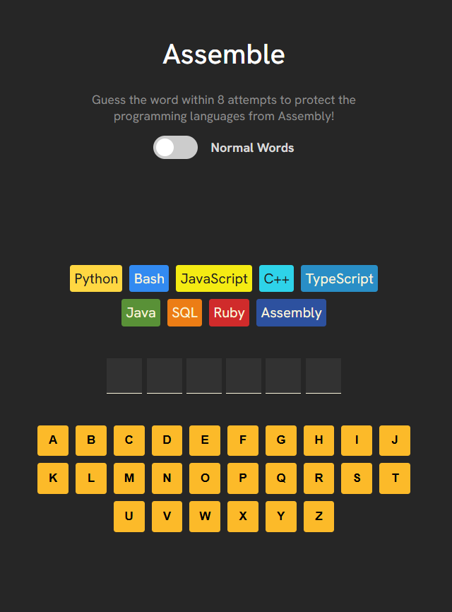
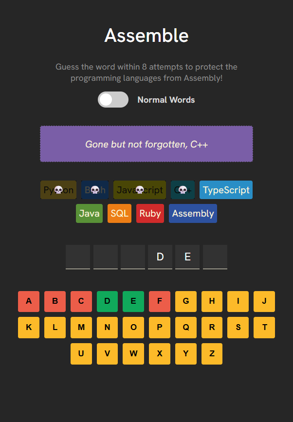

<h1>
  
  Assemble
</h1>

## Hangman with a tech twist

Live Demo ----> https://assemble10.netlify.app/

## ❓ How to play
* Guess the letters to "assemble" the word in order to protect the programming languages from the evil Assembly!
* You can switch from normal words to tech-related words and vice versa (currently under construction)

## Preview

    
    

    
    

## 🛠️ Built with
* React
* HTML, CSS, Javascript
* Vite
* During this project, i learnt about `clsx` for constructing className strings conditionally