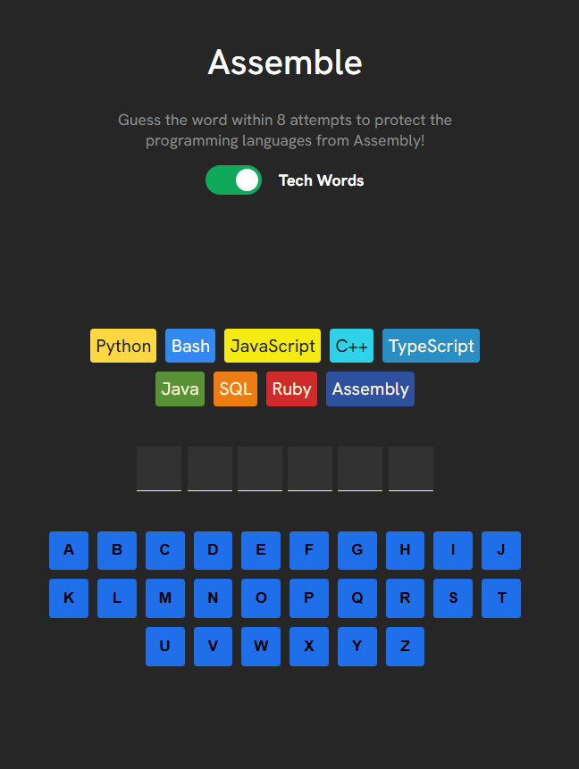
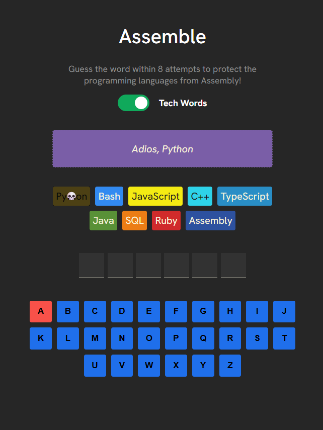

<h1>
  
  Assemble
</h1>

## Hangman game with a tech twist

Live Demo ----> https://assemble10.netlify.app/

## ❓ How to play
* Guess the letters to "assemble" the word so you can protect the programming languages from the evil Assembly!
* 8 strikes and you lose
* You can switch from normal words to tech-related words using the toggle for a more challenging experience

# Preview
## Normal Words

    
    

## Tech Words

    
    

## Winning & Losing screens

    
    

## 🛠️ Built with
* React
* HTML, CSS, Javascript
* Vite
* During this project, i learnt about `clsx` for constructing className strings conditionally